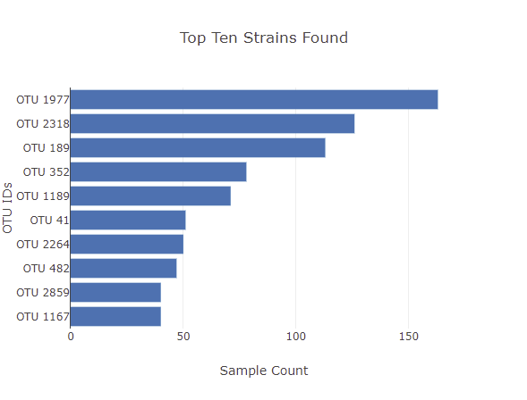
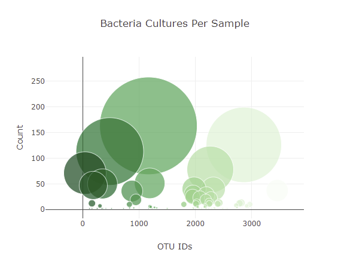

<h2>Belly Button Biodiversity</h2>
In this project, I used Javascript and Plotly to display demographic information and generate figures from JSON data based off of toggle menu selection. This project has also been deployed on GitHub Pages. Click <a href="https://civond.github.io/plotly_deployment/">here</a> to view it!

<h3>See below for sample pictures.</h3>
</img>
</img>
